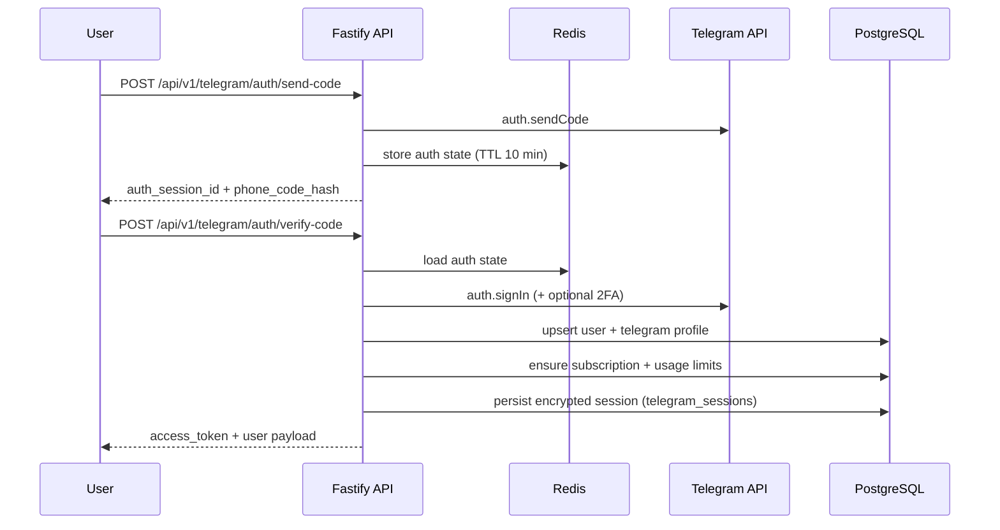

# Architecture Overview

Love Parser operates as a single backend service that exposes HTTP APIs, schedules background work, and maintains long-lived integrations with Telegram and Robokassa. The core runtime is Fastify (HTTP) + Bull (queues) + cron jobs running inside one Node.js process.

## System overview

```
Frontend (Vite SPA / Telegram Mini App)
        |
        v
Reverse proxy (TLS termination)
        |
        v
Fastify API + Workers (Node.js 20)
   |         |            |            |
   |         |            |            |
 PostgreSQL  Redis    Telegram API   Robokassa
 (state)   (cache,      (parsing,     (payments)
          rate limits,   auth)
           queues)
```

- **Fastify API** handles REST endpoints under `/api/v1`, SSE progress streams, and Prometheus metrics.
- **Bull queues** (Redis-backed) manage parsing jobs, broadcast sends, notifications, cron tasks, and audience refreshes.
- **PostgreSQL** stores durable state (users, subscriptions, usage limits, parsing history, audience segments, broadcasts, payments, error logs).
- **Redis** powers rate limiting, Telegram auth state, token blacklist, SSE progress cache, and queue messaging.
- **Integrations**: Telegram Client API for channel discovery and auth, Robokassa for subscription payments.

## Microservices & components

| Component | Technology | Responsibilities |
| --- | --- | --- |
| Fastify API (`src/server.ts`) | Fastify 4, Zod validation | HTTP routes (`auth`, `telegramAuth`, `dashboard`, `parsing`, `audience`, `subscriptions`, `metrics`, `health`). Applies helmet, cors, JWT verification, request logging, error handling, and Redis-backed rate limiting. |
| Queue manager (`src/queue/queueManager.ts`) | Bull 4 + Redis | Creates per-job queues (parsing, broadcast, notification, cleanup, audience, cron), attaches telemetry, and exposes helpers to add jobs. |
| Workers (`src/workers/index.ts`) | Bull workers | Registers handlers for each job type. `handleParsingJob` talks to Telegram, persists channels, updates progress snapshot. `handleBroadcastJob`, `handleAudienceJob`, etc., process async work. |
| Cron scheduler (`src/queue/cronScheduler.ts`) | Bull repeatable jobs | Registers cron definitions (subscription cleanup, payment checks, error log pruning) with per-job retry/backoff settings. |
| PostgreSQL pool (`src/database/connection.ts`) | `pg` Pool | Shared pool used by services (auth, dashboard, audience, subscriptions). Knex migrations build the schema. |
| Redis pool (`src/services/redis.service.ts`) | `redis` | Connection pooling with max 5 clients, `withRedisClient` helper, health checks, and stats for Prometheus. |
| Telegram session manager (`src/services/telegram/sessionManager.ts`) | `telegram`, AES-256-GCM | Sends login codes, verifies codes/TOTP, encrypts sessions, persists them in `telegram_sessions`, and restores sessions for live parsing. |
| Robokassa integration (`src/integrations/robokassa.ts`) | HMAC utilities | Builds payment URLs, formats amounts, verifies signatures from webhooks, and normalizes plan metadata. |
| Monitoring (`src/monitoring/*.ts`) | prom-client, Winston | Prometheus counters/histograms/gauges, `/metrics` route, request logging, error log persistence, dashboard caches, health endpoints. |

## Database schema summary

| Table | Purpose | Notable columns / relations |
| --- | --- | --- |
| `users` | Core identities created from Telegram login. | `telegram_id`, `phone_number`, `profile` JSON, `status`. |
| `subscriptions` | Active/trialing plans per user. | FK `user_id`, `plan_code`, `expires_at`, `metadata`. |
| `usage_limits` | Quotas for parsing/audience/broadcast actions. | Unique (`user_id`, `limit_key`), tracks `limit_value`, `consumed_value`, `resets_at`. |
| `telegram_sessions` | Encrypted Telegram session blobs. | FK `user_id`, `session_data` (AES-256-GCM), `is_active`, `device`. |
| `parsing_history` | Search jobs triggered by users. | FK `user_id`, `query`, `status`, `result_count`, `metadata`. |
| `parsed_channels` | Flattened channels returned per search. | FK `parsing_history_id`, `channel_id`, `member_count`, metadata (language/activity). |
| `audience_segments` | Derived cohorts sourced from parsing results. | FK `user_id`, FK `source_parsing_id`, JSON filters, `total_recipients`, `status`. |
| `broadcast_campaigns` & `broadcast_logs` | Outbound messaging orchestration. | Campaign metadata (`message`, `delay_config`, counters) + per-recipient logs (`status`, `error_code`). |
| `payments` | Robokassa payment attempts/results. | FK `user_id`, optional FK `subscription_id`, `amount`, `transaction_id`, JSON `payload`. |
| `notification_queue` | Future channels for user comms (email/push). | `channel`, JSON `payload`, `scheduled_at`, `status`. |
| `error_logs` | Persisted errors for observability. | `level`, `message`, `stacktrace`, JSON `context`, `expires_at`. |

## Data flow diagrams

### Parsing search lifecycle

```mermaid
flowchart LR
    A[Client UI] -->|POST /api/v1/parsing/search| B[Fastify API]
    B -->|assert subscription & quota| C[(PostgreSQL)]
    B -->|enqueue JobTypes.PARSE_SEARCH| D[Bull Queue (Redis)]
    D --> E[Bull Worker]
    E -->|searchTelegramChannels| F[Telegram API]
    E -->|persistParsedChannels| C
    E -->|saveParsingProgress| G[(Redis SSE Store)]
    E -->|increment usage| C
    G -->|SSE /progress| A
```

### Telegram authentication sequence



## Session management

1. **Telegram auth state** – temporary data (`phone_number`, `phone_code_hash`, `sessionString`) is stored in Redis with a 10-minute TTL per `auth_session_id`.
2. **Persistent sessions** – after verifying the code, `TelegramSessionManager` encrypts the MTProto `StringSession` using AES-256-GCM with a key derived from `SESSION_ENCRYPTION_KEY` and stores it in `telegram_sessions`. Only one active session per user is kept.
3. **JWT issuance** – `generateAccessToken` signs a 30-day token containing `sub`, `sessionId`, optional `telegramId`. Tokens are validated by `verifyJWT` + `getCurrentUser` on every authed route.
4. **Revocation** – `GET /api/v1/auth/logout` hashes the token and stores it in a Redis blacklist until its original expiry. The middleware checks this blacklist before accepting a token.
5. **Session rotation** – new Telegram logins deactivate previous sessions (`is_active=false`), so stolen sessions can be revoked by re-authenticating.

## Anti-spam & abuse protections

- **Global rate limiting** – `rateLimitMiddleware` increments a Redis counter per request (user ID if authenticated, otherwise IP/request ID) across a configurable window (`RATE_LIMIT_WINDOW_MS`). Returns HTTP 429 with `Retry-After`.
- **Usage quotas** – `usage_limits` table caps parsing searches, audience segments, exports, and broadcast actions. Services such as `assertParsingQuotaAvailable` and `assertAudienceQuotaAvailable` check the limit before enqueuing work.
- **Subscription gating** – Parsing and audience endpoints enforce `assertActiveSubscription`, returning HTTP 402 when a plan expires.
- **Telegram send-code throttle** – Phone-number-specific keys limit `/send-code` to one request per minute (`RATE_LIMIT_KEY_PREFIX`).
- **Queued workloads** – Bull queues serialize heavy operations (Telegram channel lookups, broadcasts) to avoid bursts that might trigger Telegram flood waits or spam detection.
- **Simulated fallback** – If live Telegram search fails, `searchTelegramChannels` falls back to deterministic simulation to prevent repeated hammering and still provide UX feedback.
- **Cron cleanup** – Scheduled jobs disable expired subscriptions, expire usage limits, and purge stale error logs to minimize stale data abuse.

## Monitoring & logging

- **Prometheus metrics** – `metricsRegistry` exports HTTP request counters, histograms, queue sizes (`job_queue_size`), DB/Redis connection gauges, Telegram API call counters, broadcast success/failure counts, and cron job metrics via `GET /metrics`.
- **Health endpoints** – `/health`, `/api/health/*` check API liveness plus PostgreSQL, Redis, and Telegram connectivity (including active session count).
- **Structured logging** – Winston logger writes JSON logs to `logs/app.log` and rotates daily files. In non-production environments, colorful console logs are enabled.
- **Error log persistence** – `errorHandler` and `logErrorEvent` record metadata into the `error_logs` table (request ID, user ID, code, stacktrace) for triage.
- **Dashboard cache invalidation** – Audience/Subscription services call `invalidateDashboardCache` after mutating totals, preserving up-to-date metrics for the UI.
- **Bull instrumentation** – Queue event listeners log job progress/completions/failures and emit Prometheus counters for queue resource monitoring.

Refer to [`DEPLOYMENT.md`](./DEPLOYMENT.md) for infrastructure steps and [`API_SPEC.md`](./API_SPEC.md) for the HTTP contract.
